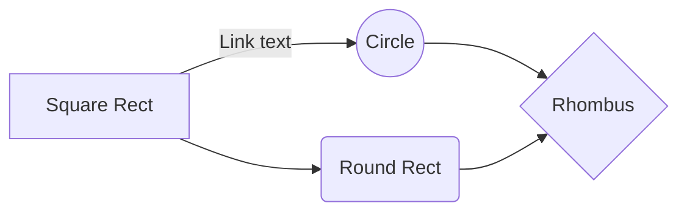

# aws AI vid Project

This was an experiment in using comfyUI to generate a python workflow which I could then host on an AWS server and use pytorch to execute. 

The goal was to allow crude drawings to be passed in and then replace the subject of the image with a new final output. 

Please contact if interested in learning more. 

# workflow_api.py
This document is a combination of all the custom nodes in comfyui in a single python script. With the intention of breaking multiple frames of an animation (mp4/gif) breaking it into line art and then outputting the results into multiple ai generate frames. with a new colour.

# Before

